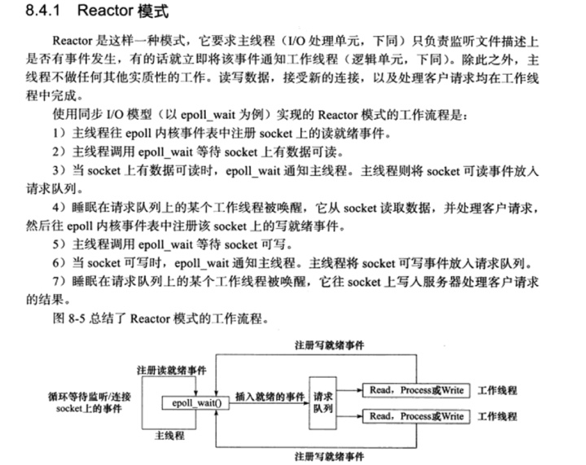
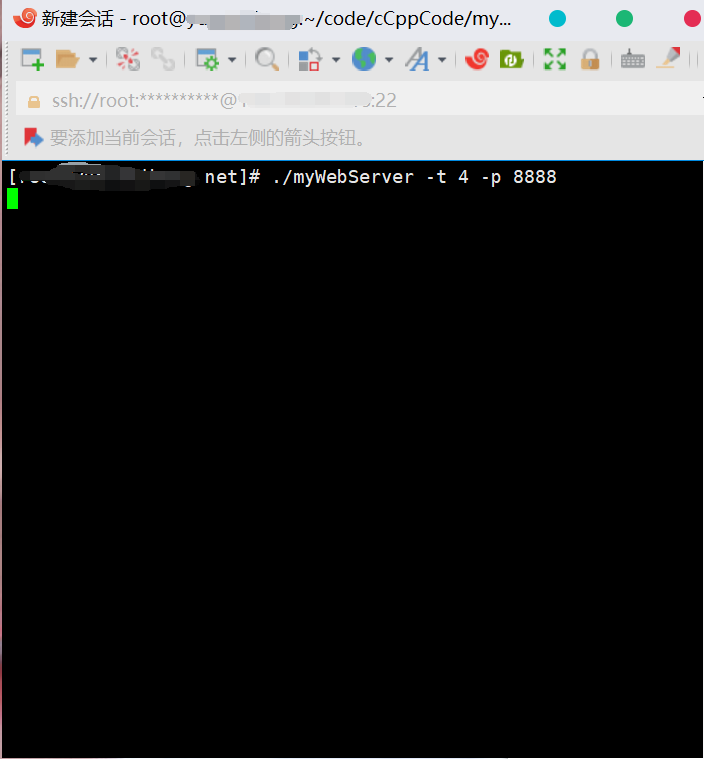

# myWebServer
自制的web服务器(使用c++11/14完成)
***

本项目基于[muduo](https://github.com/chenshuo/muduo.git) 和 [linyacool](https://github.com/linyacool/WebServer.git)

不过改用了c++11的多线程库而不是直接使用的Posix线程。而且在可读性上做了较大的改善
***
安装方式
```
cmake ./
make
cd net
./myWebServer [-t threadNum] [-p port]

默认端口号就是8888
```
***

先介绍一下各个文件的功能

* /net       项目目录
* /net/test  测试文件
* /net/help　没有在项目中使用，是三个工具类，分别是阻塞队列，有界阻塞队列和线程池
* /net/base  基本的工具类，保证了one loop one thread 和一个异步缓冲日志

***
## /net/base解析

AsyncLogging/LogStream/Logging 实现了异步缓冲日志

主要的操作在AsyncLogging中, 主要是通过一个指向当前缓冲区的ptr和一个指向下一个缓冲区的ptr


Thread和CurrentThread实现了one loop one thread中的one thread。用name 和一个计数锁来实现one thread

其中的FileUtil则实现了是一个对FILE* 的包装类

***

## /net解析

Util

这里面包含的读写函数是为了适应整个服务器在ET模式下读取文件描述符，读到不能在读（EAGAIN），写到不能在写（EAGAIN）的情况，同时包含了对文件描述符设置的一些函数，主要属性包括非阻塞、对SIGPIPE（对端关闭，本端收到的信号）的处理，TCP中Nodelay算法的禁用，TCP中LINGER的设置

这里讲一下linger属性：我们知道在TCP断开连接的时候需要经历四次握手，在TIME_WAIT状态下等待时间时长为linger time，在struct linger linger_;这里面我们需要知道两个属性l_onoff和l_linger

如果l_onoff=0的话那么主动关闭的一方不会等待进行四次握手，丢弃缓存数据直接发送RST包，并结束自己的连接
如果l_onoff=1的话是需要进行四次握手的，那么既然需要四次握手就需要TIME_WAIT状态，那么TIME_WAIT等多久就会由l_linger来决定，如果l_linger=0的话那么就会按照默认的时间2MSL来进行，否则将会使用l_linger时间来作为等待的时间，等待的过程中这个连接的状态依然为TIME_WAIT
Channel是对文件描述符的包装，并记录了这个文件描述符上的事件
Epoll则是epoll对Channel的实现
***


整个项目的难点，是Reactor模型。大概就是分发不同的读写任务。
所谓Reactor模式，是有一个循环的过程，监听对应事件是否触发，触发时调用对应的callback进行处理。
负责事件循环的部分命为EventLoop

***
EventLoopThread实现one loop one thread
One loop per thread意味着每个线程只能有一个EventLoop对象，EventLoop即是事件循环，
每次从poller里拿活跃事件，并给到Channel里分发处理。
EventLoop中的loop函数会在最底层(Thread)中被真正调用，开始无限的循环，
直到某一轮的检查到退出状态后从底层一层一层的退出。

***
HttpData和Server实现上层接口
Server启动一个监听接口，然后通过handleConn来将新链接的Channel加入Channel中，进行处理
HttpData则是解析Http请求
***

## 用WebBeach测试
先说明实验环境。
服务器，一台阿里云ECS服务器，一核，内存2G。Centos7 + gcc 8　。带宽 1Mbps
客户机，一台Ubuntu20.04, 8核，内存8G。
压力测试工具 Webbench

先在centos上开启服务在8888端口



然后在客户机上先开启2000个用户，持续时间60s,测试两次


可以发现，性能还是很优秀的。丢包率很低，但是宿舍网络不稳定，在我第三次测试时速率就只有一半了，然后我又测试了五次
发现又回归正常了，建议大家测试的时候选择网络较为稳定的环境。
***
然后在客户端上开启4000个用户，持续时间60s,测试两次


可以看出reactor模式性能还是很高，这都依赖于epoll本身处理高负载性能就非常优秀。

项目本身是有可以改进的地方。这里用的std::string当作缓冲区，不是用的char数组或者vector<char>。
使用vector<char>的性能会更高，muduo就是采用的vector<char>当缓冲区的底层结构。

***

浅谈如何学习c/c++网络编程。

如果要学习c/c++的网络编程，首先就是要学习c++的语法和一些网络知识。
学习c++呢，我推荐的是从《c++ primer》入手。然后再在后面补充标准库的多线程库的知识。
(这里说的后面是指的已经对操作系统和并发编程有一定了解，不是说读了c++ primer之后)
不过可惜的是，在我看c++ primer的时候，只有第五版，里面还没有出现多线程的内容。可以在
《c++标准库》里面阅读到后面引入的多线程库的内容。谈到多线程就不得不说一本书
《Java Concurrency in Practice》(java 并发编程实战)，这本是我见过写多线程的书里面最优秀的一本。
c++的话，我没有找到优秀的讲解并发的书籍，我更推荐陈硕的那本。

***

网络编程的学习就离不开tcp/ip详解的那几本书和apue,unp之类的书籍，不过里面的阅读顺序是有一定规律的。

我推荐先阅读《计算机网络:自顶向下方法》,然后再阅读《tcp/ip详解卷一(第一版)》,
然后把里面的tcp和ip的部分阅读了，推荐第一版是因为我觉得第二版再版得不好，而
且网络协议在这些年的变化还是很微小的，以我个人的体验第一版更加适合阅读。

然后再去阅读apue(unix 环境高级编程)或者 tlpi(Linux/unix系统编程手册)

然后再去阅读unp卷1中的tcp部分，记得阅读tlpi中的io复用。

unp卷二是将进程间通信，更像是apue的一个补充。

这些书本身就有源码和一些小lab。建议还是做一下

至于tcp/ip详解的卷二和卷三我觉得看个人喜好吧。前期阅读的价值不大，不推荐全部阅读。

操作系统部分的话，我推荐《操作系统导论》(是一本蓝皮的书，讲的三个部分，虚拟化，并发，持久化)
《操作系统概念》或者《操作系统精髓与设计原理》或者《现代操作系统》。这三本看一本就足够了，但是
有点过于晦涩，推荐还是分重点看，比如文件管理，进程调度，内存管理，死锁之类的。

视频教程的话我推荐陈硕的网络编程实战教程。


